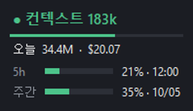
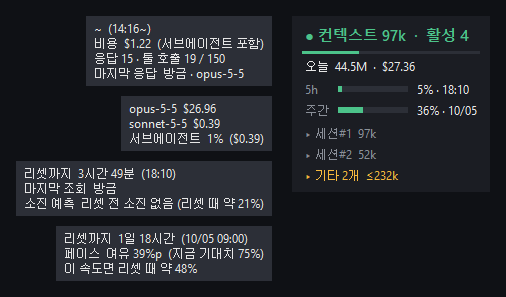

# Claude Meter

Claude Code 토큰 사용량을 화면 구석에 띄워 두는 작은 플로팅 위젯입니다 (Windows, 단일 exe, 설치 없음).

A tiny always-on-top widget that shows your Claude Code token usage. Portable single exe, no install, no API key.



```
● 컨텍스트 135k · 활성 3
━━━━━━━━━━━━━━━━━━━━━━━━
오늘  27.7M · $17.69
5h    ███░░░░░░░  20% · 12:00
주간  ████░░░░░░  35% · 10/05
 ▸ 세션#1  135k
 ▸ 세션#2  185k
 ▸ 기타 1개  ≤90k
```

## 무엇을 보여주나

| 줄 | 의미 |
|---|---|
| 컨텍스트 | 가장 최근 세션의 현재 컨텍스트 크기. 200k 노랑, 300k 빨강 (설정 가능) |
| 활성 N | 최근 10분 안에 응답이 있었던 세션 수 (2개 이상일 때만 표시) |
| 오늘 | 오늘 0시 이후 전체 토큰과 API 단가 기준 환산 비용 |
| 5h / 주간 | 플랜 한도 사용률 막대와 리셋 시각 (`/usage`와 같은 값). 80% 이상 빨강 (설정 가능) |
| 세션#N | 활성 세션이 2개 이상일 때 최근 응답 순으로 2개, 나머지는 `기타 N개`. 마우스를 올리면 작업 폴더와 시작 시각 |

### 마우스를 올리면 (v0.2.0)



| 줄 | 툴팁 |
|---|---|
| 컨텍스트 | 이 세션의 누적 비용(서브에이전트 포함) · 응답 수 · 툴 호출 수(`tool_budget` 기준) · 마지막 응답 n분 전 · 모델 |
| 오늘 | 모델별 비용 · 서브에이전트 비중 |
| 5h | 리셋까지 남은 시간 · 마지막 조회 n분 전 · **소진 예측 시각** (리셋 전에 안 닿으면 리셋 때 예상 %) |
| 주간 | 리셋까지 남은 기간 · **페이스** (지금까지 지난 기간 대비 여유/초과 %p) · 이 속도면 리셋 때 예상 % |

소진 예측은 최근 1시간 조회값의 기울기로 계산합니다. 조회값이 아직 부족하면 5시간 창 시작부터의 평균 속도를 씁니다. 조회값은 캐시 파일에 5시간치만 쌓으므로 예측 때문에 API를 더 부르지는 않습니다.

비용은 공개 API 단가로 계산한 **참고값**입니다. Pro/Max 구독이라면 실제 청구액이 아닙니다.

## 어디서 데이터를 읽나

토큰·컨텍스트·세션은 `~/.claude/projects/**/*.jsonl` - Claude Code가 응답마다 남기는 `usage` 기록만 읽습니다. API 키가 필요 없습니다.

5h / 주간 막대만 네트워크를 씁니다. Claude Code 로그인 토큰(`~/.claude/.credentials.json`)으로 `/usage`가 쓰는 엔드포인트를 120초마다 한 번 읽습니다.
- 호출 허용량이 빡빡해 429를 받으면 간격을 두 배씩(최대 15분) 늘리고, 마지막 응답은 `claude_meter_usage.json`에 캐시해 재시작해도 바로 다시 부르지 않습니다. 30분 안에 받은 값은 조회가 실패해도 계속 보여줍니다.
- **비공개 엔드포인트**라 예고 없이 바뀔 수 있습니다. 실패하면 로그로 추정한 `5h 블록` 토큰·남은 시간으로 자동 대체됩니다.
- 위젯은 토큰을 **갱신하지 않습니다**(Claude Code 로그인이 꼬일 수 있어서). 토큰이 만료되면 Claude Code가 갱신할 때까지 추정값을 보여줍니다.
- 토큰은 `api.anthropic.com` 외 어디에도 보내지 않습니다. 끄려면 설정에서 `"plan_usage": false`.

- 응답 하나가 여러 줄로 기록되므로 `message.id`로 중복을 제거합니다.
- 파일별로 읽은 위치를 기억해 새로 추가된 줄만 읽습니다 (로그 600MB 기준 첫 스캔 0.4초, 이후 0.06초).
- 서브에이전트 로그(`subagents/`)는 토큰 합계에는 포함하고 컨텍스트 계산에서는 제외합니다.
- **claude.ai 웹/데스크톱 앱 채팅은 로컬 로그가 없어 집계되지 않습니다.**

## 사용법

1. [Releases](../../releases)에서 `ClaudeMeter.exe`를 받아 아무 폴더에 두고 실행합니다.
2. 왼쪽 드래그로 이동, 더블클릭으로 접기/펴기, 오른쪽 클릭으로 메뉴(항상 위·투명도·언어·종료)를 엽니다.
   작업표시줄 버튼으로 숨기기/불러오기, 버튼 오른쪽 클릭 → "창 닫기"로 종료할 수 있습니다.
3. 설정은 exe 옆 `claude_meter.json`에 저장됩니다.

소스에서 실행: `python claude_meter.py` (Python 3.10+, 표준 라이브러리만 사용)

직접 빌드: `pip install pyinstaller` 후 `pyinstaller --onefile --windowed --name ClaudeMeter claude_meter.py`

## 설정 (`claude_meter.json`)

| 키 | 기본값 | 설명 |
|---|---|---|
| `warn_ctx` / `stop_ctx` | 200000 / 300000 | 컨텍스트 색 기준 |
| `refresh_sec` | 5 | 갱신 주기(초) |
| `lang` | `ko` | `ko` / `en` |
| `plan_usage` / `plan_refresh_sec` | `true` / 120 | 한도 사용률 조회 여부·주기 |
| `limit_red` | 80 | 한도 막대가 빨강이 되는 사용률(%) |
| `tool_budget` | 150 | 컨텍스트 툴팁에 함께 보여줄 세션당 툴 호출 기준 |
| `claude_dir` | `null` | 로그 폴더를 바꿀 때 (`CLAUDE_CONFIG_DIR` 사용자) |
| `prices` | `{}` | 단가 덮어쓰기: `{"claude-opus-5-5": [4, 20, 0.2]}` = input/output/cache read, USD per 1M |

## 한계

- 전체화면 독점 모드(일부 게임·영상) 위에는 Windows가 그리지 않습니다.
- 한도 조회가 실패했을 때 나오는 `5h 블록`은 로그로 추정한 값이라 공식 한도와 다를 수 있습니다.
- 단가는 2026-09 기준입니다. 새 모델이 나오면 `prices`로 추가하세요.
- 소진 예측·페이스는 지금 속도가 이어진다고 보는 직선 외삽입니다. 작업이 몰리거나 쉬면 크게 바뀝니다.

## License

MIT
